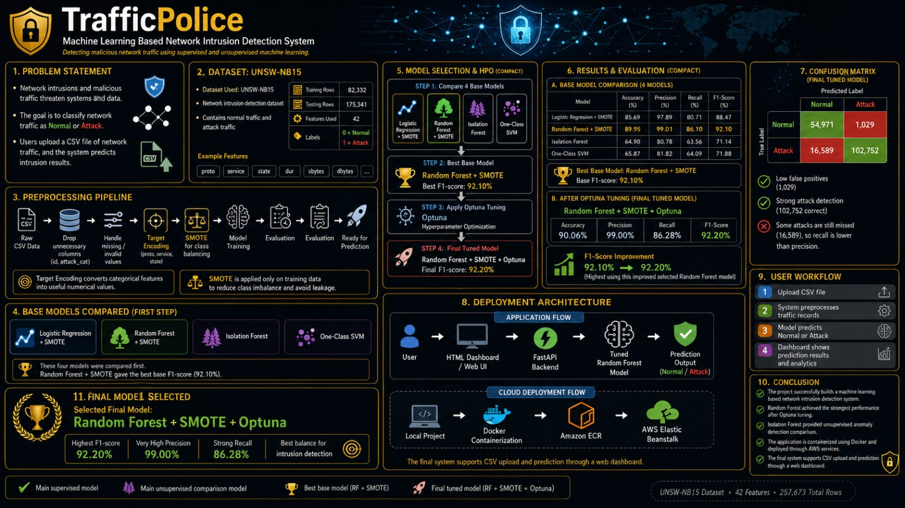
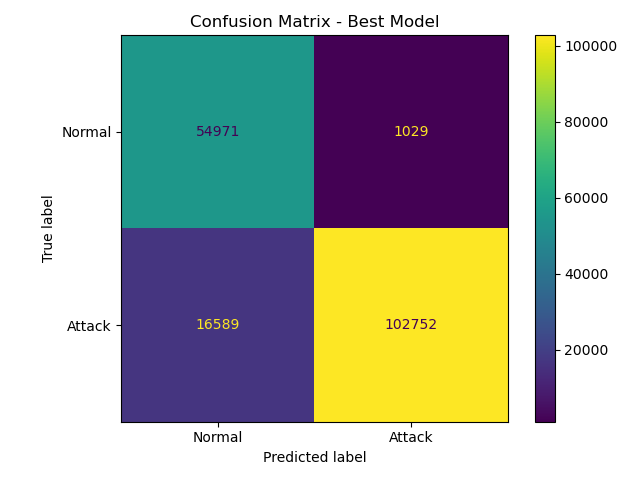

# 🚦 TrafficPolice — ML-Based Network Intrusion Detection System

> Detecting malicious network traffic using supervised and unsupervised machine learning.


---

## 📌 Overview

TrafficPolice is a complete machine learning pipeline for network intrusion detection. It classifies network traffic as **Normal** or **Attack** using the UNSW-NB15 dataset. The system compares four models, tunes the best one using Optuna HPO, and deploys the result as a web application on AWS.

Built by **Mariam Atta** and **Huzaifa Amir** — ITU, Lahore.

---

## 🧠 Pipeline



The full pipeline covers:
- Data cleaning and preprocessing
- Target Encoding for categorical features
- SMOTE for class imbalance (training data only)
- Training and comparing 4 models
- Hyperparameter tuning with Optuna
- Evaluation with F1-score, precision, recall, confusion matrix
- Deployment via FastAPI + Docker + AWS ECR + Elastic Beanstalk

---

## 📊 Dataset

**UNSW-NB15** — a realistic network intrusion detection dataset.

| Split | Rows |
|---|---|
| Training | 82,332 |
| Testing | 175,341 |
| Features Used | 42 |
| Labels | 0 = Normal, 1 = Attack |

> The dataset is not included in this repo due to size.
> Download it from the [official UNSW-NB15 page](https://research.unsw.edu.au/projects/unsw-nb15-dataset) and place the files in the `data/` folder.

---

## 🤖 Models Compared

| Model | Accuracy | Precision | Recall | F1-Score |
|---|---|---|---|---|
| Logistic Regression + SMOTE | 85.69% | 97.89% | 80.71% | 88.47% |
| Random Forest + SMOTE | 89.95% | 99.01% | 86.10% | 92.10% |
| Isolation Forest | 64.90% | 80.78% | 63.56% | 71.14% |
| One-Class SVM | 65.87% | 81.82% | 64.09% | 71.88% |
| **RF + SMOTE + Optuna (Final)** | **90.06%** | **99.00%** | **86.28%** | **92.20%** |

**Best model: Random Forest + SMOTE + Optuna**

Best Optuna parameters:
- `n_estimators`: 97
- `max_depth`: 27
- `min_samples_split`: 9
- `min_samples_leaf`: 1

---

## 🗂️ Project Structure

```
ML_PROJECT/
├── preprocess.py              # Data cleaning, Target Encoding
├── train_supervised.py        # Logistic Regression + Random Forest training
├── train_unsupervised.py      # Isolation Forest + One-Class SVM training
├── optuna_tuning.py           # Hyperparameter optimisation with Optuna
├── evaluate.py                # Model evaluation and metrics
├── requirements.txt           # Python dependencies
├── Dockerfile                 # Container build instructions
├── Dockerrun.aws.json         # AWS Elastic Beanstalk config
├── .dockerignore
├── app/
│   ├── app.py                 # FastAPI backend
│   └── templates/
│       └── index.html         # Web dashboard
├── models/                    # Saved .pkl model files (not pushed)
├── results/                   # Evaluation charts and CSVs
└── data/                      # Dataset files (not pushed)
```

---

## ⚙️ Setup & Running Locally

**1. Clone the repo**
```bash
git clone https://github.com/mariam-atta/TrafficPolice.git
cd TrafficPolice
```

**2. Install dependencies**
```bash
pip install -r requirements.txt
```

**3. Add the dataset**
Download UNSW-NB15 and place files in `data/`:
- `UNSW_NB15_training-set.csv`
- `UNSW_NB15_testing-set.csv`

**4. Train the models**
```bash
python preprocess.py
python train_supervised.py
python train_unsupervised.py
python optuna_tuning.py
```

**5. Run the web app**
```bash
cd app
uvicorn app:app --reload
```

Open `http://localhost:8000` in your browser.

---

## 🐳 Running with Docker

```bash
docker build -t trafficpolice .
docker run -p 8000:8000 trafficpolice
```

---

## ☁️ Deployment

The application was containerised with Docker, pushed to **AWS ECR**, and deployed on **AWS Elastic Beanstalk**.

Deployment flow:
```
Local Project → Docker Build → Push to AWS ECR → Deploy on Elastic Beanstalk
```

---

## 📈 Results

**Confusion Matrix — Final Tuned Model**



- ✅ 102,752 attacks correctly detected
- ✅ 54,971 normal records correctly classified
- ⚠️ 16,589 attacks missed (lower recall vs precision by design)
- Low false positives: only 1,029

---

## 🛠️ Tech Stack

- **ML:** Scikit-learn, SMOTE (imbalanced-learn), Optuna
- **Deep Learning:** — (not used; classical ML only)
- **Backend:** FastAPI
- **Frontend:** HTML, CSS
- **Containerisation:** Docker
- **Cloud:** AWS ECR, AWS Elastic Beanstalk
- **Data:** Pandas, NumPy, Matplotlib, Seaborn

---

## 👥 Authors

| Name | Student ID |
|---|---|
| Mariam Atta | BSSE23039 |
| Huzaifa Amir | BSSE23077 |

Information Technology University (ITU), Lahore, Pakistan